

  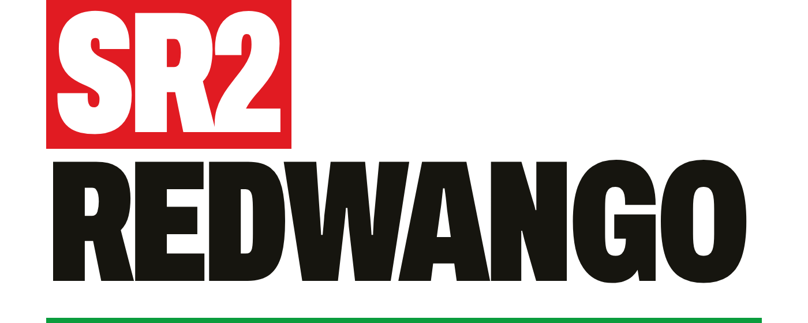

Launched on the 28 January 1999 in Japan, Sega Rally 2 was the very first Dreamcast game to support online multiplayer. As such, one could also argue it was also the very first mainstream online console game by virtue of requiring no additional hardware beyond that which shipped with the Dreamcast.

Given extensive and remarkably successful work by the community to bring back long dead internet functionality across huge swathes of the Dreamcast library, Sega Rally 2 has been conspicuous by its absence.

The primary reason for this is the fact the game uses a unique-for-Dreamcast protocol based upon the legendary 90s PC multiplayer network - DWANGO. It operates the Dreamcast networking hardware in a mode unlike any other revived (and possibly dead, to be confirmed) game.

Today, the first steps have been taken to restore this landmark functionality with the initial release of **SR2:REDWANGO** - a replacement DWANGO server. At present, this is a bridge for two copies of the flycast emulator - enabling full simulated online gameplay. There is no reason why this would not support real hardware if correctly bridged, but this requires significant further development.

This version is experimental and designed for those who are comfortable building a branch of an emulator, running python scripts, etc - this is very much not yet plug and play. In time I will write more about the technical side - but the code should tell a lot of the story.

## Status

An extremely barebones, deliberately limited server implementation which allows two copies of a modified flycast build to work through the minimum flow to enter the gameplay state.

Significant portions of the lobby are not implemented, and the initial version has hacks in place which limit functionality - i.e. to a maximum of 4 players ever being connected to the main lobby. This can and will be fixed in time.

| Part | State |
| --- | --- |
| Dial and connect | Works |
| Lobby, user list, chat rooms | Works |
| Create a team, join a team | Works |
| Select track, car, launch game | Works |
| A live two-player race | Works |

## What you need

1. **Python 3.8 or later.** The server uses only the standard library. There are no packages to install.
2. **A Flycast build with the serial bridge.** Standard Flycast cannot reach this server as Sega Rally 2 operates the modem outside of PPP. A proof of concept implementation is detailed below.
3. **Your own copy of the game**, and **your own Dreamcast BIOS**. This project supplies neither. **Only the Japanese release of Sega Rally 2 supports online play**. 
4. **Two instances of the customised emulator.** They can run on one computer.

## The Server

Start the server first:

    cd server
    python sr2lobby.py

The server listens on port 7654. Set `SR2_PORT` to use a different port.

## The emulator

Sega Rally 2 does not speak PPP. It speaks its own protocol directly over the modem. Flycast's existing network backend expects PPP, so cannot carry this traffic.

The fork below adds a **serial bridge**. The bridge takes the raw modem byte stream and sends it to a TCP address that you choose. 

    https://github.com/awarmplace/flycast/tree/dwango-serial-bridge

The bridge is on the `dwango-serial-bridge` branch, not on master. Build it with Flycast's normal build instructions. 

Then set one environment variable before you start the emulator:

    MODEMBRIDGE=127.0.0.1:7654 (or other if you have modified sr2lobby.py)

The emulator reads this once, when it starts. Set it in the same window that launches the emulator. 

### Required emulator settings

Set these two options, or the game does not draw its network screens:

    rend.EmulateFramebuffer   = yes
    rend.RenderToTextureBuffer = no

They live in `emu.cfg`, next to the emulator. You can also set them in the GUI, under Settings then Video: "Emulate Framebuffer" on, "Render to Texture Buffer" off.

The game is Japanese and the networking screens have no English mode. An explanation of how to proceed is detailed below.

## How to play

### Step 1. Connect. Do this on BOTH consoles

**1.** Choose the network mode from the main menu. If you get stuck on a green please wait screen, you have not turned the emulate framebuffer mode on.

  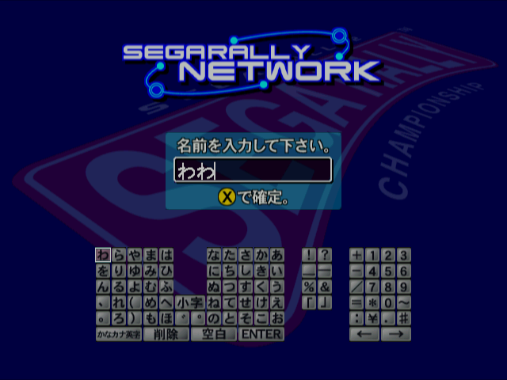

**2.** Set a player name - **ensure both player names are unique, the server does not handle collisions yet.**

**3.** Dial. (press the key mapped for Dreamcast X twice)

  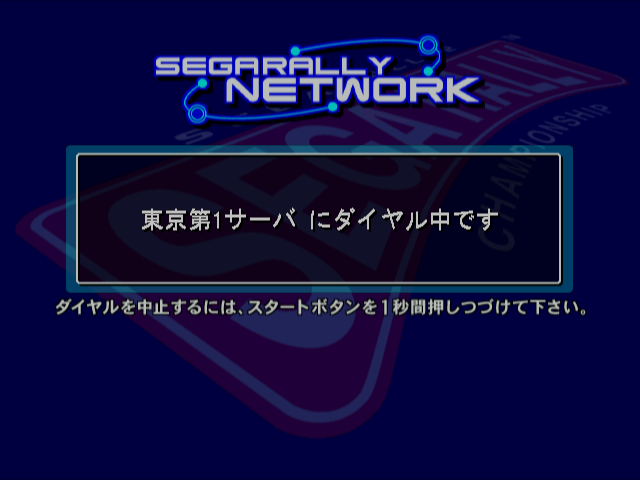

**4.** The game will go through its dialling process shown above, it will go through a couple of screens.

  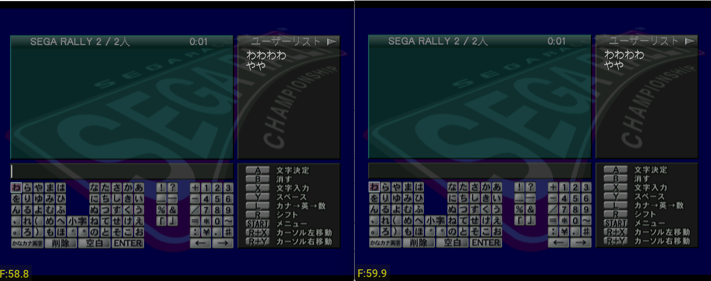

If everything has connected correctly on both clients, you should see the above - both emulators sitting in the lobby.

### Step 2. Create a team. Player one only

  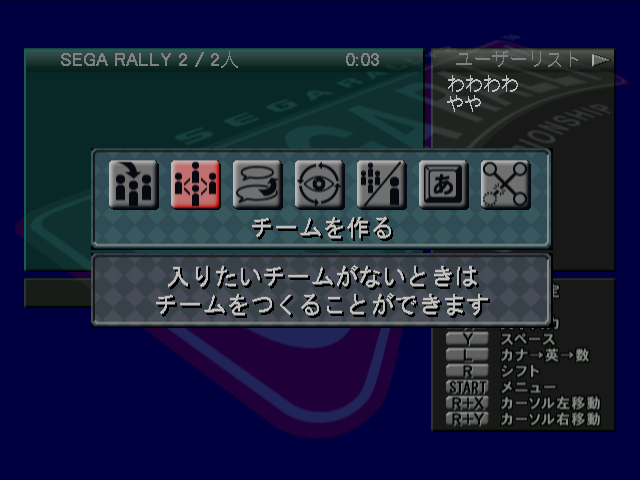

**1.** Press Start to open the menu, and go right one icon.

  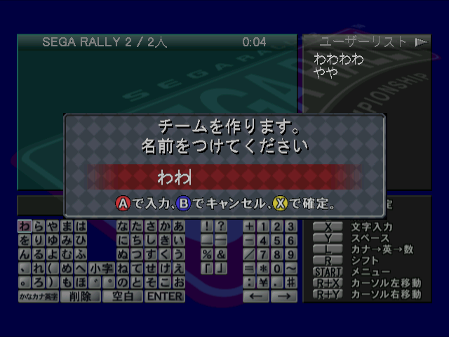

**2.** Press A twice, you will get a Team name input.

**3.** Enter a team name (press A twice to get a couple of characters), then confirm with X.

  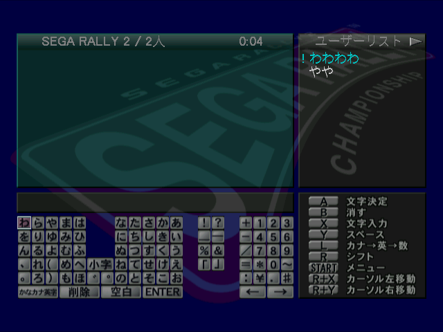

**4.** Your player name will turn blue and a ! will show next to it. This indicates you are the leader.

### Step 3. Join the team. Player two only

  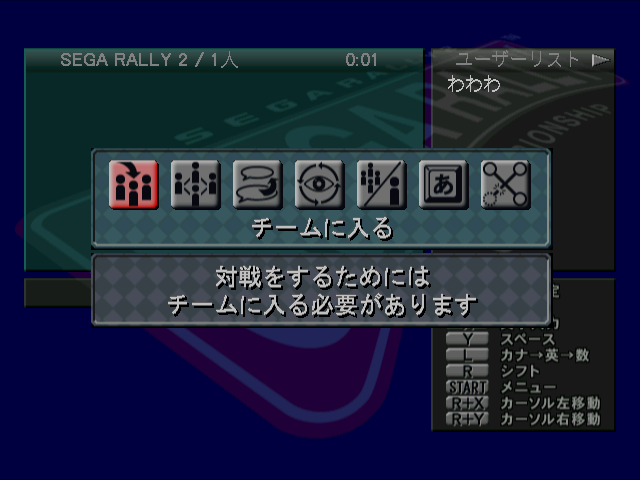

**1.** Press Start to open the menu, then press A on the FIRST icon to open the join team dialogue.

  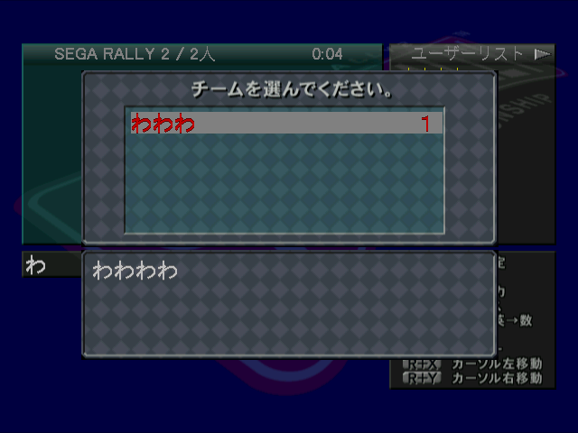

**2.** You will see the team name. Press A to join the team.

  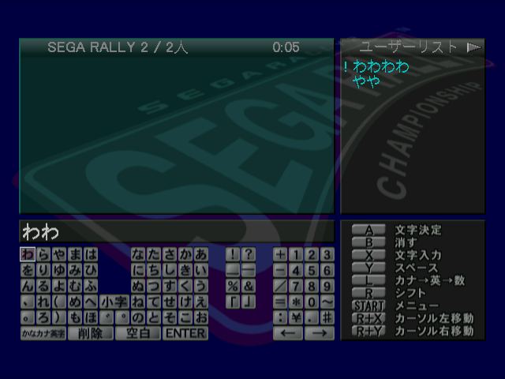

**3.** Both names will now be blue.

### Step 4. Start the race. The leader only

  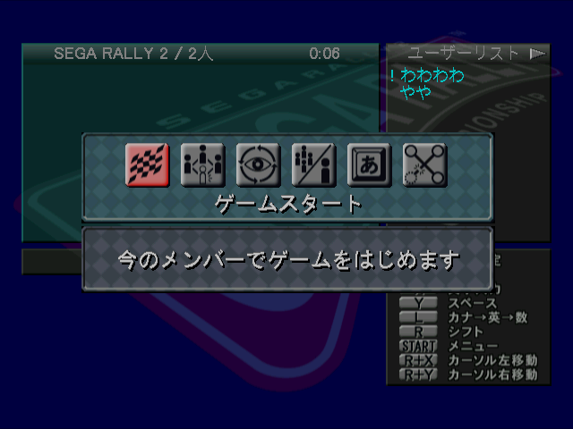

**1.** Open the menu with Start on the leader. You will see a chequered flag.

**2.** Press A, and confirm again with A.

  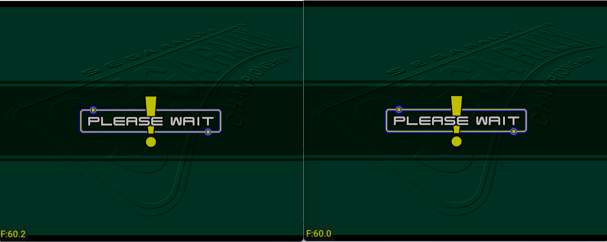

**3.** The game should move to Please wait on BOTH emulators.

  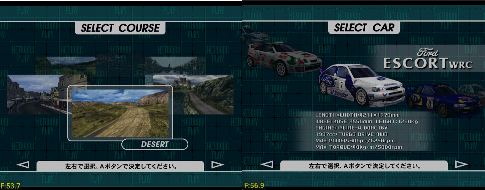

**4.** The game will load - you will get a select track screen.

**5.** Navigate through these normally by confirming / selecting your car, track etc.

  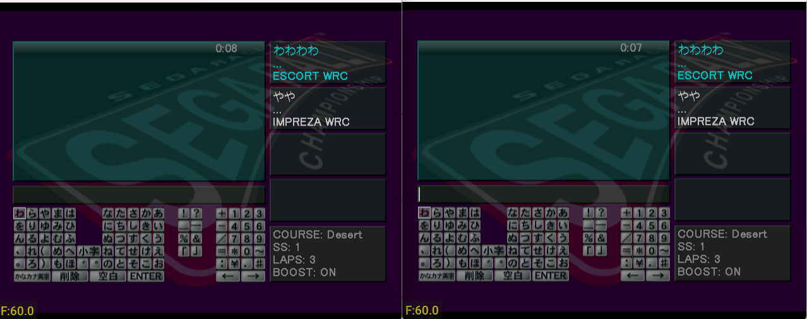

**6.** You will then be transported to the game lobby - both players visible with their selections.

  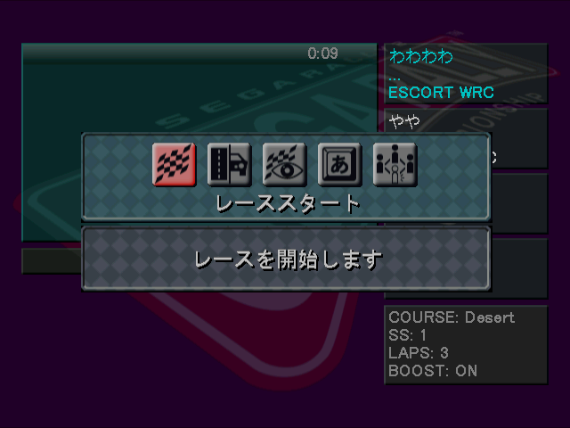

**7.** The leader needs to press Start to open the menu, and then A, A again.

  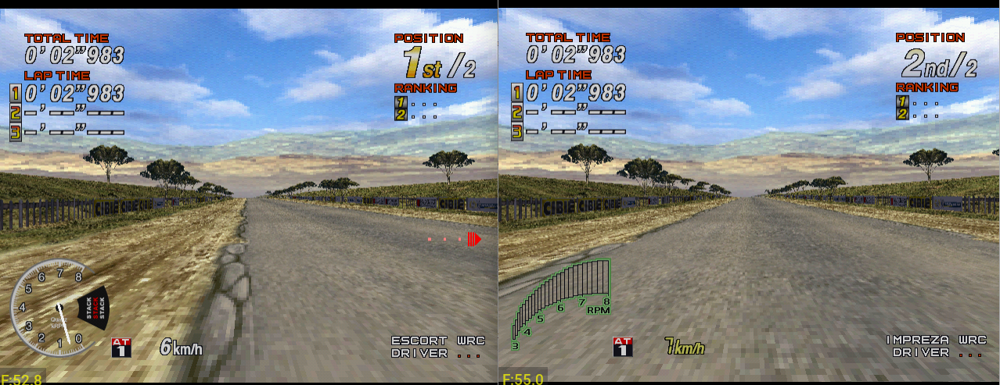

**8.** The game launches - you are in game.

Nothing further is tested. The exit flow may or may not work correctly.

## AI Usage

This project was built with AI assistance, and I want to be straightforward about that.

Reimplementing a dead network protocol from the client binary alone is slow, tedious work. It means reading decompiled code, forming a theory about what the missing server used to say, and testing that theory until the game answers. It is, for the most part, extremely unrewarding work, chasing down dead ends and fighting errors that simply present by doing _nothing_.

Others have revived Dreamcast servers before this, frequently with far less to work from. That work is why any of this was even conceivable, and their work deserves significantly more credit than my own.

## Legal

This project contains no code and no data from Sega Rally 2. It contains no BIOS and no disc image. You must supply your own copy of the game.

The protocol description here was produced by observing the traffic and by studying the game's own network library, for the purpose of making an abandoned online service work again.

## License

GNU Affero General Public License, version 3. The full text is in `LICENSE`.

The Affero licence is used rather than the plain GPL because this is a server.
The plain GPL asks for source only when software is distributed. Section 13 of
the Affero licence also asks for it when people use the software over a network,
which is how anyone will actually meet this one.

